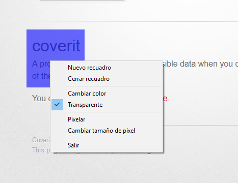
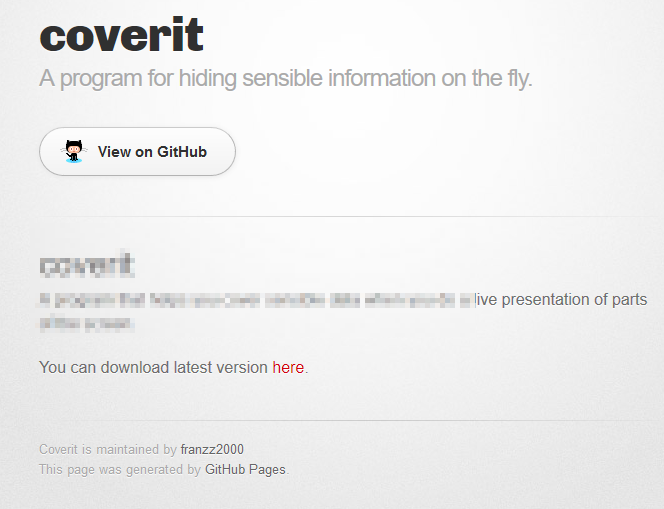

# coverit

A program that helps you cover sensible data when you do a live presentation of parts of the screen.

###Screenshots

You can download latest version [here](http://franzz2000.github.io/coverit/ejecutables/CoverIt-v02.exe).
