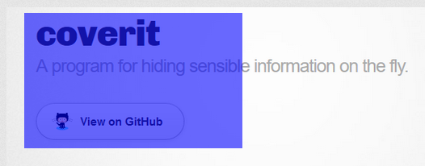
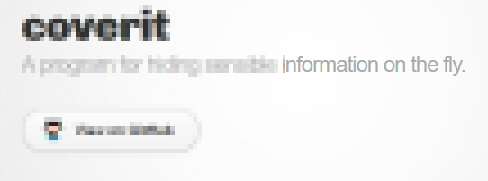

# coverit

A program that helps you cover sensible data when you do a live presentation of parts of the screen.

### Screenshots

You can download latest version [here](https://github.com/franzz2000/coverit/releases/latest).
